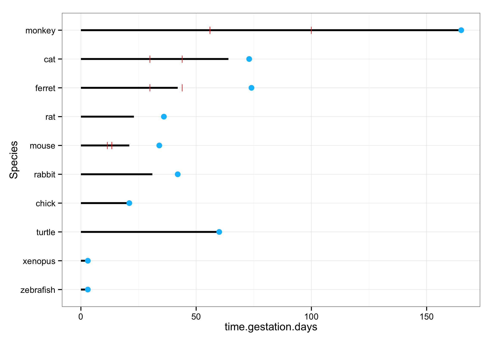

# Comparative Vertebrate Brain Development #

The point of this project is explore the comparative timelines of vertebrate brain development using the graphical capabilities of R.

## R Markdown notes
This is an R Markdown document from RStudio. Markdown is a simple formatting syntax for authoring web pages (click the **MD** toolbar button for help on Markdown).

When you click the **Knit HTML** button a web page will be generated that includes both content as well as the output of any embedded R code chunks within the document. You can embed an R code chunk like this:

# Import dataset
Copy and paste from `brainDevMilestones.xlsx`:  


```{r}
brainDev = read.delim(pipe("pbpaste"))
brainDev$Species  <- factor(brainDev$Species,as.character(brainDev$Species))  #this will reorder the factor based on the row order we had in the dataframe (instead of by alphabetical order as is the default)
```

You can also embed plots, for example

```{r fig.width=7, fig.height=6}
require(ggplot2)
##qplot version
qplot(time.gestation.days,Species,data=brainDev,geom="segment",xend=0, yend=Species)

##ggplot version
p <- ggplot(brainDev,aes(time.gestation.days,Species))
p <- p + geom_segment(aes(xend = 0, yend = Species),size=1)
p <- p + geom_point(aes(vision.onset.days,Species),size=3,colour="deepskyblue") + theme_bw()
p + geom_point(aes(L5.ng.start,Species),shape="|",size=3,colour="red") + geom_point(aes(L2.3.ng.start,Species),shape="|",size=3,colour="red")
ggsave(file=paste("vertebrateBrainDevelopmentTimeline", format(Sys.time(),"%y%m%d-%H%M%S"), ".pdf",sep=""))
ggsave(file=paste("vertebrateBrainDevelopmentTimeline", format(Sys.time(),"%y%m%d-%H%M%S"), ".png",sep=""))
```


